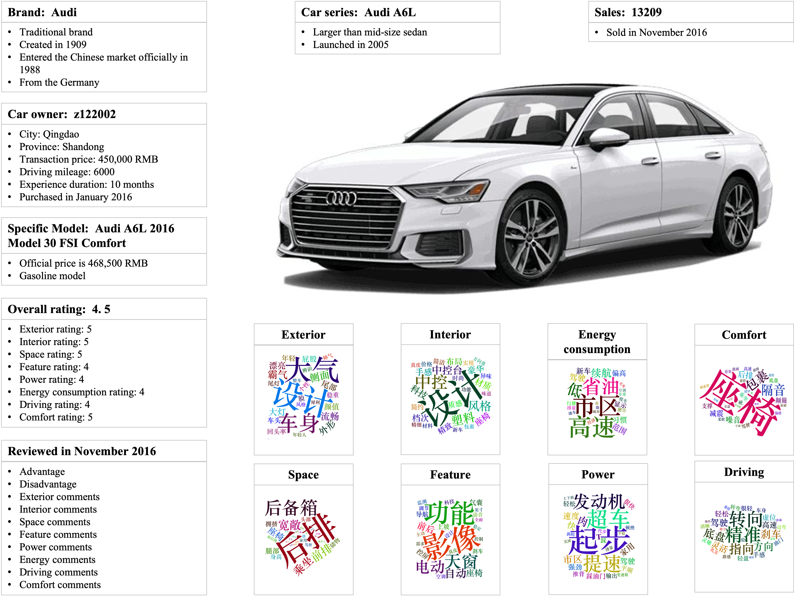

---  
     
    

# About

The SRNI-CAR dataset addresses the limitations in current automotive industry datasets, offering a robust solution for various business analytics needs. Spanning the period from 2016 to 2022, it encompasses a wide-ranging repository of data pertinent to China's automobile sector, encompassing crucial facets such as sales data, online reviews, and industry news.

What makes the SRNI-CAR dataset stand out is its combination of industry news, development insights, automotive marketing data, consumer online reviews, and sales information. It also introduces previously unavailable variables like model launch dates and brand entry dates. This broader scope opens up new possibilities for research compared to existing datasets, improving both analytical accuracy and interpretability.

In the automotive sector, the SRNI-CAR dataset holds significant business value. Sales data helps automakers and marketers track market trends, while review data aids in understanding consumer preferences, assessing marketing effectiveness, and analyzing product strengths and weaknesses. Additionally, including industry news, development insights, and automotive publicity empowers automakers to stay informed about industry trends and competition.   

# Dataset Description

## Sales data    

| Variables                   | Description                                                                                        |
|:----------------------------|:---------------------------------------------------------------------------------------------------|
| Car series                  | Name of the car series.                                                                            |
| Brand                       | Name of the brand.                                                                                 |
| Year                        | Year in which the car series was sold.                                                             |
| Month                       | Month in which the car series was sold.                                                            |
| Car model type              | Car model category: Sedan, SUV and MPV.                                                            |
| Brand energy type           | Brand category based on energy type of vehicle produced.                                           |
| Size                        | Vehicle size: mini, minivan, minibus, small, compact, mid-size, larger than mid-size, full-size.   |
| Brand country of origin     | Country in which the brand was created.                                                            |
| Model launch date           | Year when the car series was launched on the Chinese market.                                       |
| Brand establishment date    | Year the brand was created.                                                                        |
| Brand entered China date    | Year when the brand officially entered the Chinese market.                                         |
| Sales                       | Total sales of the car series in the month.                                                        |

## Reviews    

| Variables                   | Description                                                                                        |
|:----------------------------|:---------------------------------------------------------------------------------------------------|
| Car series                  | Name of the car series.                                                                            |
| Brand                       | Name of the brand.                                                                                 |
| Size                        | Vehicle size: mini, minivan, minibus, small, compact, mid-size, larger than mid-size, full-size.   |
| Car model type              | Car model category: Sedan, SUV and MPV.                                                            |
| User ID                     | Name that users use when making online reviews.                                                    |
| Year of review              | Year when the user reviews.                                                                        |
| Month of review             | Month when the user reviews.                                                                       |
| Specific model purchased    | Specific model of a car series purchased by a user.                                                |
| Official price              | Official prices for specific models purchased.                                                     |
| Car energy type             | Vehicle energy type: gasoline vehicle, diesel vehicle, hydrogen vehicle, and so on.                |
| Brand energy type           | Brand category based on energy type of vehicle produced.                                           |
| Brand country of origin     | Country in which the brand was created.                                                            |
| Brand establishment date    | Year the brand was created.                                                                        |
| Brand entered China date    | Year when the brand officially entered the Chinese market.                                         |
| Model launch date           | Year when the car series was launched on the Chinese market.                                       |
| Year of purchase            | Year the user purchased the model.                                                                 |
| Month of purchase           | Month the user purchased the model.                                                                |
| Sales                       | Total sales of the car series in the month when the user purchased the model.                      |
| Experience duration         | Months between purchase date and review posting date.                                              |
| Province                    | Province in which the user purchased the model.                                                    |
| City                        | City in which the user purchased the model.                                                        |
| Transaction price           | Real transaction price of the model.                                                               |
| Average energy consumption  | Gasoline, diesel, electricity, or hydrogen consumed for every 100 kilometers traveled.             |
| Mileage                     | Kilometers the user has driven the model at the date the review was posted.                        |
| Overall rating              | User's overall rating of the vehicle purchased.                                                    |
| Exterior rating             | User's rating of the exterior of the vehicle.                                                      |
| Interior rating             | User's rating of the interior of the vehicle.                                                      |
| Space rating                | User's rating of the space of the vehicle.                                                         |
| Features rating             | User's rating of the feature of the vehicle.                                                       |
| Power rating                | User's rating of the power of the vehicle.                                                         |
| Energy consumption rating   | User's rating of the energy consumption of the vehicle.                                            |
| Driving rating              | User's rating of the driving of the vehicle.                                                       |
| Comfort rating              | User's rating of the comfort of the vehicle.                                                       |
| Advantage                   | The advantages of the model as perceived by the user.                                              |
| Disadvantage                | The disadvantage of the model as perceived by the user.                                            |
| Exterior comments           | User's comments on the exterior of the vehicle.                                                    |
| Interior comments           | User's comments on the interior of the vehicle.                                                    |
| Space comments              | User's comments on the space of the vehicle.                                                       |
| Features comments           | User's comments on the feature of the vehicle.                                                     |
| Power comments              | User's comments on the power of the vehicle.                                                       |
| Energy consumption comments | User's comments on the energy consumption of the vehicle.                                          |
| Driving comments            | User's comments on the driving of the vehicle.                                                     |
| Comfort comments            | User's comments on the comfort of the vehicle.                                                     |

## News and information    

| Variables                   | Description                                                                                        |
|:----------------------------|:---------------------------------------------------------------------------------------------------|
| Title                       | Title of the information.                                                                          |
| Pageview                    | Number of times the information was viewed.                                                        |
| Number of comments          | Number of comments the information received.                                                       |
| Text                        | Text content contained in the information.                                                         |
| Release date                | Date on which this information was published.                                                      |
| Author                      | Person who posted the information.                                                                 |
| Source                      | Source of the information.                                                                         |
| Information type            | Whether the information is original, compiled, a press release, or reprinted from another platform.|
| Information label           | Labels chosen by the author that summarizes the information, based on its content.                 |


# Downloads

| Data type   | Format (size)   | Download |
|:------------|:----------------|:---------|
| Sales       | csv (3.6 MB)   | [link](https://figshare.com/ndownloader/files/42438726?private_link=255ef697e8b7e3115087) |
| Reviews     | csv (480 MB) | [link](https://figshare.com/ndownloader/files/44295110?private_link=255ef697e8b7e3115087) |
| News and Information | csv (224 MB) | [link](https://figshare.com/ndownloader/files/42438729?private_link=255ef697e8b7e3115087) |

# Citation

If you publish work based on, or using, this dataset, we would appreciate citations to the following:

```bibtex
@inproceedings{ding23srnicar,
   author = {Ruixin Ding and Bowei Chen and James M. Wilson and Zhi Yan and Yufei Huang},
   title = {SRNI-CAR: A Comprehensive Dataset for Analyzing the Chinese Automotive Market},
   booktitle = {Proceedings of 2023 IEEE International Conference on Big Data (BigData)},
   pages = {3405--3412},
   month = {12},
   year = {2023}
}
```

# Contact
Ruixin Ding [(2589583d@student.gla.ac.uk)](mailto:2589583d@student.gla.ac.uk)

Bowei Chen [(bowei.chen@glasgow.ac.uk)](mailto:bowei.chen@glasgow.ac.uk)

# License

<a rel="license" data-spdx="CC-BY-NC-4.0" href="http://creativecommons.org/licenses/by-
nc/4.0/"></a><br />This work is licensed under
a <a rel="license" data-spdx="CC-BY-NC-4.0" href="http://creativecommons.org/licenses/by-
nc/4.0/">Creative Commons Attribution-NonCommercial 4.0 International License</a>.

