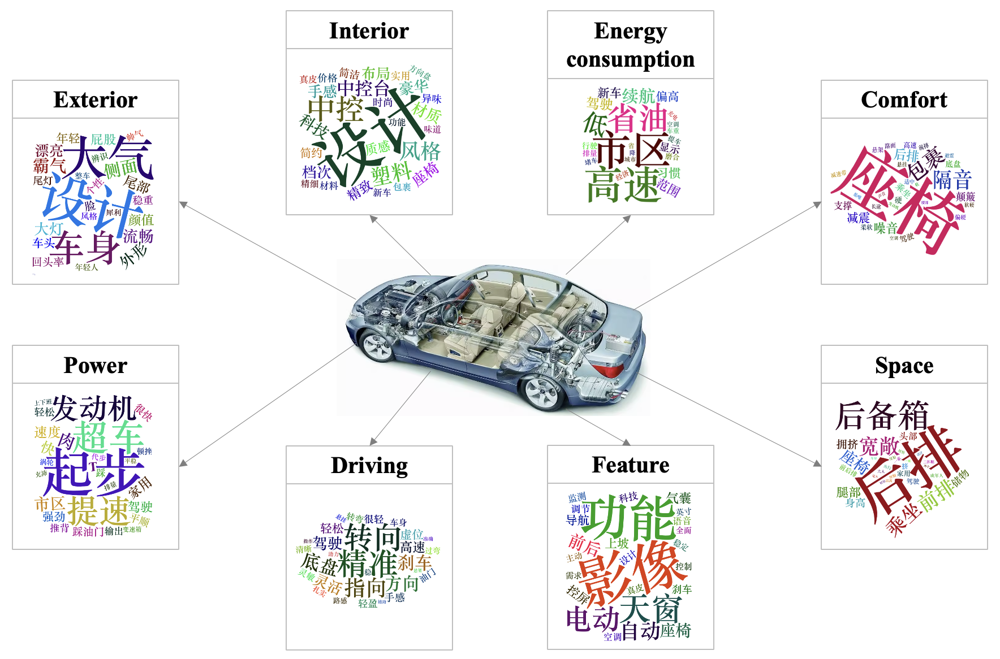
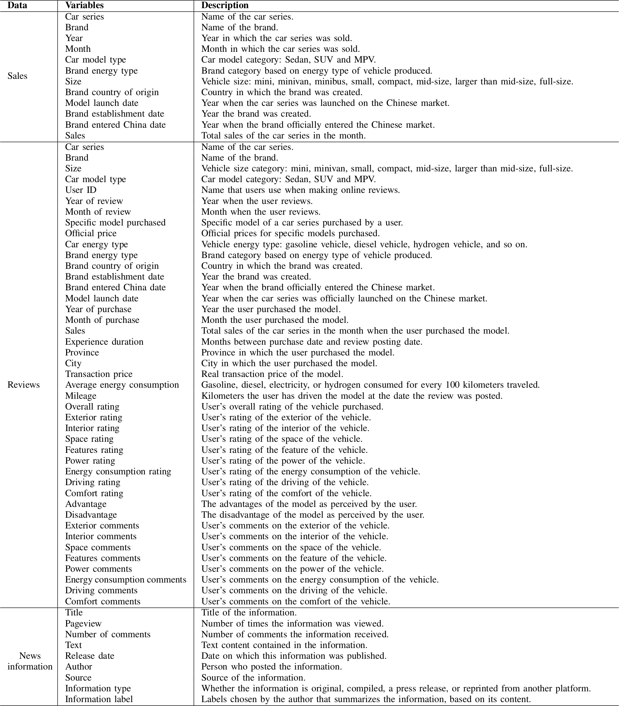

The SRNI-CAR dataset aims to make up for the inability of existing data sets in the automotive industry to meet a variety of business analysis needs.
It contains a large amount of information related to China's auto industry from 2016 to 2022, including sales data, online reviews, industry news, and more.
To learn more about this dataset and to get inspiration from application examples of its use in automotive analysis, please refer to our [paper](#Citation).

# Contributions

1.  The SRNI-CAR dataset not only consolidates industry news, development insights, automotive marketing data, consumer online reviews, and sales information but also introduces valuable variables previously absent, such as model launch dates and brand inception dates. Therefore, it supports a broader spectrum of research possibilities compared to existing publicly available datasets in the automotive domain. Furthermore, it enhances analytical accuracy and interpretability. 
2.  The SRNI-CAR dataset possesses substantial business value in the automotive sector. Sales data aids automakers and marketers in discerning market trends, while review data facilitates the identification of consumer preferences, evaluation of marketing effectiveness, and product strengths and weaknesses analysis. Incorporating industry news, development insights, and automotive publicity empowers automakers to grasp industry trends and market competition. 

# Dataset Overview

Click for larger image

[](Overview.png)

# Downloads

| Data type   | Format (size)   | Download |
|:------------|:----------------|:---------|
| Sales       | csv (3.39 MB)   | [link](https://figshare.com/ndownloader/files/42438726?private_link=255ef697e8b7e3115087) |
| Reviews     | csv (457.74 MB) | [link](https://figshare.com/ndownloader/files/42438720?private_link=255ef697e8b7e3115087) |
| Information | csv (213.69 MB) | [link](https://figshare.com/ndownloader/files/42438729?private_link=255ef697e8b7e3115087) |

# Citation

If you publish work based on, or using, this dataset, we would appreciate citations to the following:

```bibtex
@inproceedings{ding23srnicar,
   author = {Ruixin Ding and Bowei Chen and James M. Wilson and Zhi Yan and Yufei Huang},
   title = {SRNI-CAR: A Comprehensive Dataset for Analyzing the Chinese Automotive Market},
   booktitle = {},
   pages = {},
   address = {},
   month = {},
   year = {}
}
```

# Contact

bowei[dot]chen[at]glasgow[dot]ac[dot]uk

# License

<a rel="license" data-spdx="CC-BY-NC-4.0" href="http://creativecommons.org/licenses/by-
nc/4.0/"></a><br />This work is licensed under
a <a rel="license" data-spdx="CC-BY-NC-4.0" href="http://creativecommons.org/licenses/by-
nc/4.0/">Creative Commons Attribution-NonCommercial 4.0 International License</a>.

